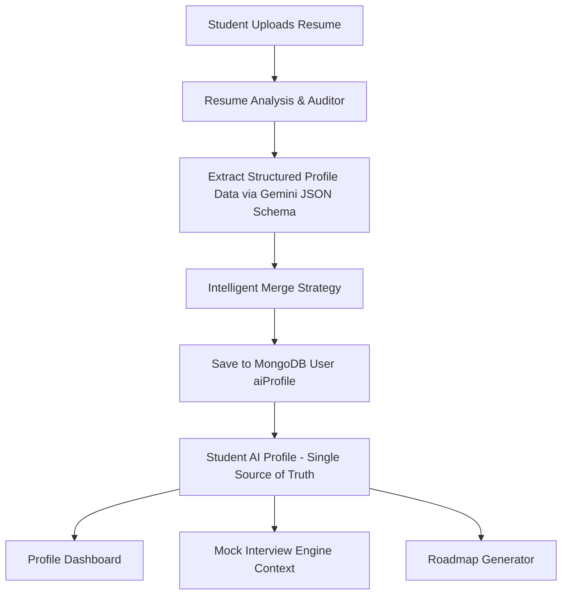
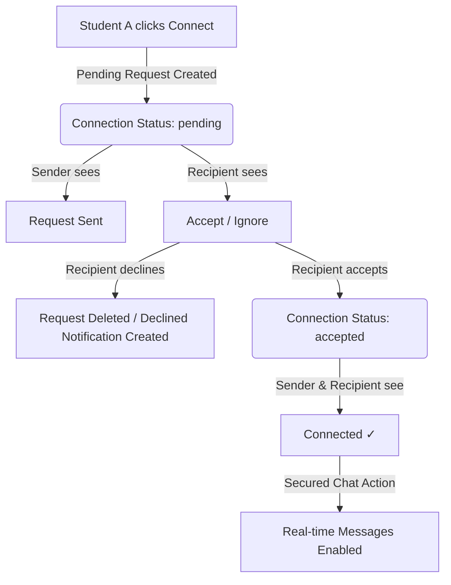
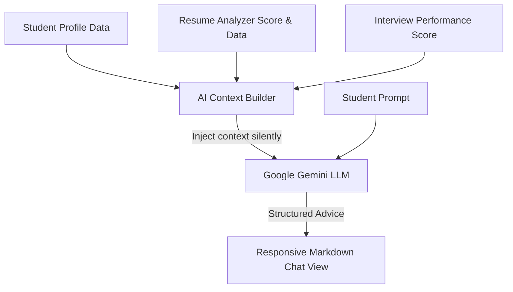

# Campus Media — AI-Powered Student Placement & Career Companion

Campus Media is an integrated, state-of-the-art career companion web platform designed to elevate the university placement experience. Powered by Google Gemini AI, the platform enables students to audit their resumes against current industry demands, simulate realistic live-voice technical and behavioral mock interviews directly in the browser, generate structured 6-stage career roadmaps, and review a community-driven technical question bank.

---

## 🎯 Purpose
The purpose of Campus Media is to bridge the gap between academic education and industry readiness. By automating resume auditing and live interview practice using state-of-the-art LLMs, the platform democratizes high-quality career coaching and placement preparation for students, regardless of their backgrounds.

## 👁️ Vision
Our vision is to build an all-in-one AI career co-pilot for universities. In the future, the platform will evolve into a scalable Multi-Tenant Software-as-a-Service (SaaS) solution, allowing multiple campuses to operate isolated workspaces with custom placement criteria, recruiter dashboards, and automated batch stats.

---

## 💻 Technology Stack

### Frontend Client SPA
* **Framework**: React 18 (SPA with custom Hooks and Context Providers)
* **Routing**: React Router DOM (configured with `HashRouter` to prevent client-side routing fallback failures)
* **State Management**: Zustand (for light, global authentication state orchestration) and React AppContext
* **Styling**: Tailwind CSS (sleek dark gradients, responsive grid layouts, modern typography)
* **Visualizations & Charts**: Recharts (interactive dashboard statistics for admins)
* **Real-time Live Audio**: Web Audio API (integrating microphone buffers) + Client-side WebSocket streams

### Backend Server
* **Framework**: Node.js & Express.js (supporting unified dev setups and serving static assets in production)
* **Database Layer**: MongoDB (via Mongoose models) with a fully-functional local filesystem JSON fallback engine (`dbHelper.js`)
* **Security & Auth**: JWT (JSON Web Tokens) with `cookie-parser` cookie verification and `bcryptjs` password hashing
* **File Uploads**: Multer (in-memory storage parsing)
* **PDF Extraction**: pdf-parse (parsing text out of uploaded PDF resumes)
* **Security Headers**: Helmet & CORS configurations
* **Rate Limiting**: Express Rate Limit (limiting API endpoints)

### AI Core
* **SDK**: `@google/genai` (Official Node and Web SDKs)
* **Models**:
  * **Resume Audit / Roadmaps / Feedback Reports**: `gemini-flash-latest` (backend REST API)
  * **Live Voice Mock Interview**: `gemini-2.5-flash-native-audio-preview-12-2025` (low-latency client-side WebSockets audio streaming)

---

## 📂 Folder Structure

```text
campus_media/
├── client/                     # Frontend SPA React Application
│   ├── src/
│   │   ├── api/                # Axios instance configuration and request interceptors
│   │   ├── components/         # Reusable layouts, navigation headers, and modal dialogs
│   │   ├── context/            # React AppContext provider for social feeds, notes, and states
│   │   ├── pages/              # High-level page components (Feed, MockInterview, Admin, etc.)
│   │   ├── services/           # Gemini API client wrapper functions
│   │   ├── store/              # Zustand global authentication and token management stores
│   │   ├── utils/              # Client-side audio parsing and conversion utilities
│   │   ├── App.jsx             # Main Router, Route guards, and global Error Boundary
│   │   ├── main.jsx            # React root DOM rendering and Tailwind CSS bootstrap
│   │   └── index.css           # Core styling tokens, utility classes, and custom gradients
│   └── package.json            # Client dependencies and workspace settings
├── server/                     # Backend API & Server Application
│   ├── controllers/            # Controller logic parsing requests and returning API responses
│   ├── middleware/             # Express middlewares (Auth verification, Role checks, Error handlers)
│   ├── models/                 # Mongoose MongoDB schema models
│   ├── routes/                 # Express route definitions grouped by resource
│   ├── scripts/                # Database utility scripts (seeding, cleanup)
│   ├── services/               # Core business services (Email logic, Token services, AI prompts)
│   ├── src/                    # Older/Alternate TS implementation sources (kept for reference)
│   ├── utils/                  # Cloudinary initialization and file storage filters
│   ├── validators/             # Request payload structural validators
│   ├── server.js               # Entry point Express unified server (starts REST + mounts Vite)
│   └── package.json            # Backend Node.js scripts and package configurations
├── docs/                       # Project Documentation Directory (Architecture, APIs, Database, etc.)
├── data/                       # Fallback JSON files database storage
├── App.jsx                     # Legacy root-level client file
├── server.js                   # Legacy root-level server file
├── package.json                # Root package configurations, unified scripts, and dev tools
├── tailwind.config.js          # Tailwind CSS layout configurations
├── vite.config.js              # Vite configuration (entry routes, plugins, pre-bundling)
└── PROJECT_ANALYSIS.md         # Top-level code review and technical debt summary
```

---

## 🗺️ Architecture Overview
Campus Media uses a unified Node.js backend. In development, the Express server mounts a Vite development instance as middleware, serving API endpoints and hot-reloaded client scripts on a single unified port (3000). 

The primary business flow consists of:
1. **REST APIs**: Used for Authentication, User Profile setup, Feed posts, commenting, notes library, job listings, and generating structured AI analysis (resume audits and career roadmaps).
2. **Direct WebSockets (AI Client)**: The live mock interview feature connects directly from the student's browser to the Google Gemini Live Gateway using client-side WebSockets. It transmits raw microphone PCM audio packages and plays returned model voice packages in real-time.

---

## 🚀 Installation & Local Setup

### Prerequisites
* **Node.js**: Version 18.x or higher
* **MongoDB**: A running local MongoDB instance (e.g., `mongodb://localhost:27017`) or a MongoDB Atlas URI
* **Google Gemini API Key**: An active API key obtained from Google AI Studio

### Setup Steps
1. **Clone the Repository**
   ```bash
   git clone https://github.com/your-username/campus-media.git
   cd campus-media
   ```

2. **Install Root Dependencies**
   ```bash
   npm install
   ```

3. **Configure Environment Variables**
   Create a `.env` file in the root workspace directory:
   ```env
   # Database URI configuration
   MONGO_URI=mongodb://127.0.0.1:27017/campus-media

   # Secret key for JWT signature validation
   JWT_SECRET=super_secret_jwt_signature_key_here

   # Server-side Google Gemini API Key
   GEMINI_API_KEY=AIzaSy...your_gemini_api_key_here
   ```

---

## 🛠️ Build & Execution Commands

### Run Development Server
Launches the Express unified server on port 3000, bringing up Vite in middleware mode.
```bash
npm run dev
```

### Production Build
Generates compiled static files inside `dist/` and bundles the Express server using esbuild into `dist/server.cjs`.
```bash
npm run build
```

### Run Production Server
Starts the compiled and bundled production build of the server.
```bash
npm run start
```

---

## 🔐 Authentication
Authentication is implemented using JSON Web Tokens (JWT). When a user registers or logs in, a cookie containing a signed JWT token is returned, or the client receives an authorization token header. The token contains the user's `id` and `role`. 
* **Role-Based Access Control (RBAC)**: Supported roles are `USER` (Students) and `ADMIN`. Specific routes check the decoded token to authorize operations.

---

## 🎙️ Socket.IO & WebSocket Integration
* **Socket.IO Status**: The backend does not currently run a Socket.IO server. Peer-to-peer messaging uses REST API polling and local Zustand client caches.
* **WebSocket Streams**: Client-to-Gemini WebSocket connections are created during mock interviews using the `@google/genai` library's `ai.live.connect` method. This allows real-time, low-latency audio transmission directly between the browser and Google's servers.

---

## 🤖 AI Features
* **Resume AI Auditor**: Extracts PDF resume text, evaluates it against ATS constraints, and generates optimized action-driven bullet points.
* **Live Mock Interviewer**: Engages the user in a voice-to-voice interview matching their target role, resume skills, and chosen difficulty level.
* **Career Roadmap Generator**: Examines current skills and target domains to produce a detailed 6-stage progression path.
* **AI Career Assistant**: Mentors students, answers career questions, and advises on interview preparation.

---

## 📊 Centralized Student AI Profile Integration

We have integrated a centralized Student AI Profile inside the user record, serving as the single source of truth for all AI modules.

### Data Context Flow


### Key Integration Tasks Accomplished
1. **Resume Analysis Data Synchronization**: After resume parsing and score auditing, a separate parsing service categorizes technical skills, academic info (college, CGPA, department), projects, work experience, achievements, and career preferences, saving them directly into the student's `aiProfile` record.
2. **Intelligent Merge Strategy**: Prevents overwriting of user-curated profile details. New skills are appended without duplicating. Educational details, projects, experience, and achievements are matched based on normalized identifiers and merged/updated only if information is new or more complete.
3. **Mock Interview Personalization**: The voice interview loads the centralized student `aiProfile` on initialization and passes the complete structured context to the Gemini Live Gateway. This avoids redundant resume parsing, reduces latency, and guarantees personalized questions.
4. **Dashboard Integration**: The AI Insights dashboard tab displays Resume Score, Total Skills, Programming Languages, Frameworks, Projects Count, Achievements Count, Certificates Count, and Interview Score dynamically fetched directly from the student's centralized AI Profile.


---

## 🌐 Student Connection System & Unified Network Module

The student connection system behaves similarly to professional networks like LinkedIn, enabling peer discovery, connection invite management, and secure chat restrictions.

### Connection State Diagram


### Key Unified Network Features
1. **Discover Tab**: High-level paginated student directory. Filterable by department, course, graduation year, skills, recently joined, and searchable by text queries.
2. **Requests Management Tab**: Keeps track of incoming invitations (Accept / Decline buttons) and sent requests (Cancel Request button).
3. **My Connections Tab**: List of active peer connections. Includes quick shortcuts to Message (opens conversation list), View Profile, and Remove Connection.
4. **Scored Suggestions Tab**: Peer recommendations. Scores candidates based on overlapping department, courses, skills, and common interests.
5. **Secure Chat Gatekeeping**: Restricts chat history requests and message transfers on the backend. Conversation lists and direct chat messages are blocked unless the connection status is accepted.

---

## 🤖 AI Mentor (Career & Learning Assistant)
The AI Mentor is a personal career and learning companion designed to guide students throughout their academic and professional journeys.

### 📐 Architecture & Session Flow
Unlike traditional messaging or profiles, the AI Mentor does not store chat history in the database. Conversations are lightweight, private, and fully session-based (resets upon page refresh/closure).



### Key Features
1. **Student Context Injection**: Before any prompt is sent, the AI Mentor dynamically loads the student's name, department, year, college, career goals, skills, projects, achievements, resume scores, and mock interview grades. The student never has to explain their profile twice.
2. **Mentoring Scope Guard**: Polices prompt bounds. Unrelated prompts (e.g., politics, harmful questions) are politely redirected back to educational, coding, career, and professional milestones.
3. **Structured Guidance Layouts**: Provides detailed responses formatted with markdown headings, lists, bullet points, and syntax-highlighted code blocks.
4. **Prompt Suggestion Cards**: Speeds up interaction on start with quick clickable prompt shortcuts (e.g. "Improve my resume", "Prepare me for placements", "Suggest what to learn next").
5. **Interactive Controls**: Users can stop ongoing stream mock generations, copy code snippets/responses to clipboard, and trigger advice regeneration.
---

## 🤝 Contributing Guide
1. Create a branch off `main` (e.g., `feature/resume-refinement`).
2. Implement and test your modifications.
3. Keep all documentation up to date inside the `docs/` folder.
4. Run a verification build (`npm run build`) locally before raising a PR.

---

## 📏 Coding Standards
* **JavaScript**: Use modern ES modules (`import`/`export`) for server-side code.
* **React**: Use functional components with hooks, and structured CSS classes via Tailwind.
* **Safety**: Check for DB connectivity state fallback; do not allow direct raw API credentials to be written to client pages.

---

## ⚠️ Known Issues
* **Scanned Resume Parsing**: `pdf-parse` fails to extract text from scanned, image-only PDFs.
* **No Database Fallback Sync**: Running the local JSON filesystem database mode stores files locally in `/data` but does not automatically synchronize them back to MongoDB once the database comes online.

---

## 🗺️ Future Roadmap
1. **Multi-Tenant SaaS Architecture**: Split core schemas to support organizational sub-routing and tenant isolation keys.
2. **True Real-time Chat**: Implement a real-time messaging system using Socket.IO on the server.
3. **CI/CD Integration**: Add automated GitHub Actions pipelines to run code linters, unit tests, and Docker container builds.

---

## 📊 Project Status
**Active Development** - Core features are implemented and ready for placement prep simulation. Phase 1 documentation is complete.
