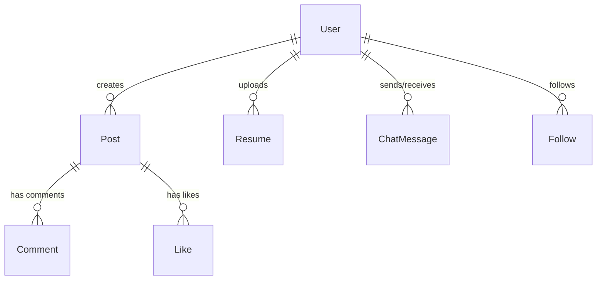

# Database Documentation

This document explains the database layout, relationships, indexes, unique constraints, and the hybrid storage fallback system.

---

## Storage Architecture
Campus Media uses a dual-mode storage engine designed for reliability:
1. **Primary Database (MongoDB)**: Express server connects to MongoDB using Mongoose models. Command buffering is set to false (`bufferCommands: false`) to ensure fast failures instead of hanging requests.
2. **Fallback Database (Local JSON Files)**: If MongoDB connection fails, the database controller `dbHelper.js` intercepts operations and writes data to JSON collections stored in the `/data` folder at the root.

---

## 📂 Collections Schema Reference

### 1. User
Stores user accounts, credentials, configuration profiles, and verification statuses.
* **Fields**:
  * `name` (String, required)
  * `email` (String, unique index, required)
  * `password` (String, required)
  * `role` (String, enum: `['USER', 'ADMIN']`, default: `USER`)
  * `status` (String, enum: `['PENDING', 'ACTIVE', 'BLOCKED']`, default: `PENDING`)
  * `year` (String, junior/senior graduation indicators)
  * `headline` (String)
  * `bio` (String)
  * `skills` (Array of Strings)
  * `education` (Array of Objects: school, degree, fieldOfStudy, startYear, endYear)
  * `notificationSettings` (Object: emailAlerts, pushAlerts)
  * `createdAt` (Date, default: `Date.now`)

### 2. Resume
Caches extracted resume text and ATS score reviews.
* **Fields**:
  * `userId` (ObjectId, Ref: `User`, required)
  * `rawText` (String, required)
  * `contentHash` (String, unique hash, required)
  * `targetRole` (String, default: `Developer`)
  * `analysis` (Object, stores detailed Gemini audits)
  * `createdAt` (Date, default: `Date.now`)

### 3. Post
Stores social posts.
* **Fields**:
  * `authorId` (ObjectId, Ref: `User`, required)
  * `content` (String, required)
  * `mediaUrl` (String, optional file reference)
  * `mediaType` (String, image/document tags)
  * `likes` (Array of ObjectIds, Ref: `User`)
  * `createdAt` (Date, default: `Date.now`)

### 4. ChatMessage
Logs peer messaging.
* **Fields**:
  * `senderId` (ObjectId, Ref: `User`, required)
  * `receiverId` (ObjectId, Ref: `User`, required)
  * `senderName` (String)
  * `content` (String, required)
  * `channel` (String, sorted composite key of sender and receiver IDs)
  * `timestamp` (Date, default: `Date.now`)

### 5. Question
Review questions contributed by the student community.
* **Fields**:
  * `submittedBy` (ObjectId, Ref: `User`, required)
  * `company` (String, required)
  * `role` (String, required)
  * `questionText` (String, required)
  * `textHash` (String, unique index, required)
  * `difficulty` (String, enum: `['Easy', 'Medium', 'Hard']`)
  * `status` (String, enum: `['PENDING', 'APPROVED', 'REJECTED']`, default: `PENDING`)

---

## 🔗 Schema Relationships

* **User References**: User ID is the primary key referencing authors in Posts, Comment, Like, Follow, SavedPost, Resume, and ChatMessage.
* **Likes & Comments**: Map directly to Post ObjectIds.
* **Chat Composite Channel Key**: Created by sorting sender and receiver IDs alphabetically and joining them with an underscore (e.g. `userA_userB`), making it easy to fetch message history for specific threads.

---

## ⚡ Indexes & Unique Constraints
* **`users.email`**: Unique index to prevent duplicate accounts.
* **`questions.textHash`**: SHA-256 hash of the question text to prevent duplicate question submissions.
* **`resumes.contentHash`**: SHA-256 hash of the resume text to cache Gemini audits and avoid redundant AI calls.
* **`chatmessages.channel`**: Index to speed up message retrieval times.

---

## ⚙️ Local Filesystem JSON Fallback Details
When MongoDB is unavailable, [dbHelper.js](file:///d:/campus_media/server/services/dbHelper.js) mocks collection calls by performing local filesystem operations:
* Collections are saved in `/data/<collectionName>.json` (e.g. `/data/users.json`).
* It implements mock query methods:
  * `find(query)`: Performs array filter operations.
  * `findOne(query)`: Returns the first matching element.
  * `create(doc)`: Appends a document to the array and writes the updated JSON back to the file system.
  * `findByIdAndUpdate(id, updates)`: Updates a matching record in the array.
  * `findByIdAndDelete(id)`: Filters out the matching record.

### Current Problems
* **Lack of Data Synchronization**: Running the local JSON filesystem database mode stores files locally but does not automatically synchronize them back to MongoDB once the database comes online.
* **Concurrency Issues**: Writing updates directly to JSON files is not thread-safe and can cause data corruption if multiple writes occur at the same time.
