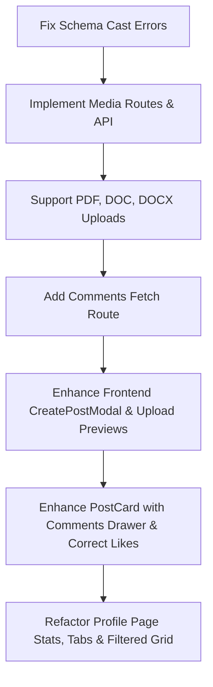

# Home Feed Page & Profile Integration Audit Report

This document details the audit of the feed, post components, upload system, API calls, database flow, state management, mobile responsiveness, and profile integration in the Campus Media Platform.

## 1. Frontend Audit (`client/`)

### A. Home Feed (`FeedPage.jsx` & `PostCard.jsx`)
* **Likes & Comments State Sync:** 
  * `PostCard.jsx` has a local state `const [liked, setLiked] = useState(false);` which is initialized to `false` and doesn't check if the current user has already liked the post.
  * Clicking "Comment" does not open any interface to view or add comments. Comments are not fetched or displayed on the feed.
* **Upload Media Options:**
  * The triggering input in the feed shows "Media", "PYQ", "Article" buttons, but they do not invoke any image/document select dialog.
  * `CreatePostModal.jsx` has an image button `Image size={20}` which has no click handlers, no file select element, and no file preview mechanism.
  * There is no document selector for `.pdf`, `.doc`, `.docx` files.

### B. Profile Page (`Profile.jsx`)
* **Tab Mismatch:** 
  * The tabs are currently `Posts`, `About`, `AI Insights`, `Experience & Edu`, `Saved`, and `Network`.
  * The specification requires an Instagram-style profile post grid with tabs: `Posts`, `Projects`, `Achievements`, and `Resources` which automatically display and filter content uploaded by the student.
* **Stats Mismatch:**
  * Statistics for Total Posts, Followers, Following, and Likes Received need to be displayed prominently in the profile information.

---

## 2. Backend Audit (`server/`)

### A. Database Fallback (UUID / Cast Errors)
* **The Error:** `Cast to ObjectId failed for value "77f55271-4509-4866-9fa6-2a13f80a7590" (type string) at path "userId"`
  * **Cause:** When MongoDB is offline, or users register under fallback, they are assigned UUID strings like `77f55271-4509-4866-9fa6-2a13f80a7590`. Mongoose schemas require `userId` to be a strict MongoDB `ObjectId`, raising cast validation errors during session/post creation.
  * **Solution:** Modify `userId` types in schemas to `mongoose.Schema.Types.Mixed` (or `String`) to gracefully support both native MongoDB ObjectIds and local fallback UUID strings.

### B. Media Upload API
* `mediaController.js` defines an `upload` and `delete` method but **no route matches `/api/media`**. It is never imported or used.
* Supported formats: The document uploads only support `.pdf`. The audit requires support for `.pdf`, `.doc`, and `.docx`.
* **Solution:** Add `.doc` and `.docx` to allowed extensions list and register the media routes inside `server.js`.

### C. Comment Retrieval Route
* There is a route to create a comment (`POST /api/posts/comment/:id`) but **no route to retrieve comments** (`GET /api/posts/comments/:id`).
* **Solution:** Implement comment retrieval route in `postController` and `postRoutes`.

---

## 3. Real-Time Interactions (Likes, Comments & Post Creation)
* Fetching the feed does not return whether the logged-in user liked the post (`isLiked`). We must annotate fetched posts with `isLiked` by checking the `Like` collection.
* The `createPost` flow must return a populated user object so that the newly created post immediately renders on the feed with the user's name and profile picture.

---

## 4. Proposed Implementation Plan

### File-by-File Changes Required:
1. **`server/models/Session.js` & `server/models/Post.js` & `server/models/Comment.js` & `server/models/Like.js` & `server/models/Follow.js` & `server/models/SavedPost.js` & `server/models/Media.js`**: Update `userId`, `followerId`, `followingId` types to `mongoose.Schema.Types.Mixed` to prevent cast exceptions.
2. **`server/utils/cloudinary.js`**: Add `.doc` and `.docx` files to allowed extensions.
3. **`server/controllers/mediaController.js`**: Expand allowed extensions to support `.doc` and `.docx` documents.
4. **`server/routes/mediaRoutes.js`** (New File): Expose upload and delete API.
5. **`server/server.js`**: Register `/api/media` routes.
6. **`server/controllers/postController.js`**:
   * Add `getComments` method.
   * Annotate posts with `isLiked` when fetching feed and user posts.
   * Ensure newly created posts return correct user metadata.
7. **`server/routes/postRoutes.js`**: Add `GET /comments/:postId` route.
8. **`client/src/store/postStore.js`**:
   * Add `fetchComments` action.
   * Handle correct status for likes and comments.
9. **`client/src/components/CreatePostModal.jsx`**:
   * Implement file selector for images and documents.
   * Add image/document preview.
   * Upload media to server prior to post submission.
   * Add selectors for Post Type (General, Project, Achievement, Resource/PYQ).
10. **`client/src/components/PostCard.jsx`**:
    * Render document cards with Name, Size, and View/Download buttons.
    * Add Comments section that displays list of comments and handles new comment submissions.
    * Handle delete and edit functionality.
11. **`client/src/pages/Profile.jsx`**:
    * Render instagram-style post grids.
    * Implement filter tabs: `Posts`, `Projects`, `Achievements`, `Resources`.
    * Show statistics correctly (Total Posts, Followers, Following, Likes Received).
