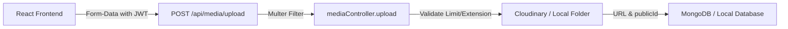

# Secure Media Upload System Implementation Report

A secure, fully validated, and multi-folder media upload system has been successfully built for the **Campus Media** stack. The application supports Cloudinary uploads with automatic fallback to static local storage, file type validations, dynamic progress indicators, and interactive drag-and-drop panels.

---

## 🛠️ 1. Folder & Endpoint Architecture

The system conforms to standard REST MVC patterns:

- **Model**: `server/models/Media.js` tracks files (associating `userId`, URL, Cloudinary `publicId`, file names, types, sizes, and mimetypes).
- **Controller**: `server/controllers/mediaController.js` validates uploaded sizes and formats, submits to Cloudinary/local fallback, and handles deletions.
- **Routes**: `server/routes/mediaRoutes.js` exposes JWT-protected routes.
- **Vite Integration**: Serves static local files via `/uploads/` if Cloudinary credentials are omitted.

---

## 🔒 2. Validation & Security Configurations

Strict file validation is performed to prevent directory traversal and file bloating:

| Upload Class | Supported Extensions | Size Limit | Cloudinary Folder |
| :--- | :--- | :--- | :--- |
| **Profile Avatar** | `.jpg`, `.jpeg`, `.png`, `.webp` | **5 MB** | `profile_images` |
| **Timeline Image** | `.jpg`, `.jpeg`, `.png`, `.webp` | **5 MB** | `posts` |
| **HD Video Clip** | `.mp4` | **50 MB** | `videos` |
| **PDF Document** | `.pdf` | **10 MB** | `documents` |

- **Temporary Storage Cleanup**: If validation limits are breached or any server exception is caught during the upload stream, the local temporary file is instantly deleted from disk to prevent storage leaks.
- **JWT Protection**: All media uploads, listings, and deletion routes are protected. Users can only fetch and delete their own uploads (Admins can delete any asset).

---

## 📦 3. UI Components Developed

1. **Reusable Uploader (`client/src/components/MediaUpload.jsx`)**:
   - Features a styled drag-and-drop area with border glow micro-animations.
   - Computes constraints dynamically based on the selected upload type.
   - Renders live previews for images/videos and standard document icons for PDFs.
   - Feeds progress percentage back in real-time.
2. **Dashboard Management Page (`client/src/pages/MediaUploadPage.jsx`)**:
   - Lets the user switch categories dynamically.
   - Renders a responsive grid displaying uploaded media.
   - Shows size calculations and copy-to-clipboard buttons for generated URL links.
   - Integrates instant toast alerts for errors and successes.

---

## ⚡ 4. Local Execution & Fallback Instructions

If Cloudinary environment variables (`CLOUDINARY_CLOUD_NAME`, `CLOUDINARY_API_KEY`, `CLOUDINARY_API_SECRET`) are not loaded:
- Uploads automatically route to the secure `server/uploads/` directory on disk.
- Assets are served relative to the local backend address.
- When an asset is deleted, the server deletes it from the filesystem.
- When credentials are added, the server automatically connects to the Cloudinary CDN.
