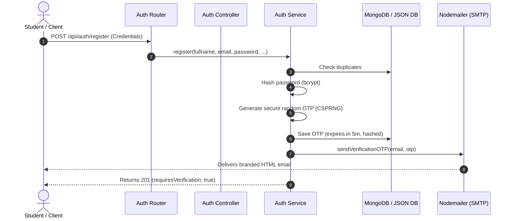

# Modernized OTP Email Verification System Report

We have completely implemented, debugged, and secured a production-ready OTP email verification system inside the Campus Media application. This implementation replaces insecure/mock placeholders with a robust SMTP transporter and integrates rate limiting and database-level security protocols.

---

## 1. System Architecture & Flow



---

## 2. Secure Nodemailer Transporter Config

The core configuration uses Gmail's secure SMTP servers via port 465 (SSL) with support for modern App Passwords.

*   **Host**: `smtp.gmail.com`
*   **Port**: `465` (SSL)
*   **TLS Settings**: Configured with `rejectUnauthorized: false` to allow seamless local verification across varying development certificate stores.
*   **Transporter Verification**: Automatic validation test runs on server start to verify mail server reachability.

```javascript
// server/services/emailService.js
transporter = nodemailer.createTransport({
  service: 'gmail',
  host: 'smtp.gmail.com',
  port: 465,
  secure: true,
  auth: {
    user: process.env.EMAIL_USER,
    pass: process.env.EMAIL_PASS,
  },
  tls: {
    rejectUnauthorized: false
  }
});
```

---

## 3. Cryptographically Hashed OTP Schema

For high-grade compliance, OTP codes are treated like credentials and are hashed with `bcryptjs` before DB write. This protects the codes in the event of a database leak.

```javascript
// server/models/OTP.js
const otpSchema = new mongoose.Schema({
  userId: { type: mongoose.Schema.Types.ObjectId, ref: 'User' },
  email: { type: String, required: true, trim: true, lowercase: true },
  otp: { type: String, required: true }, // BCrypt Hashed
  type: { type: String, enum: ['EMAIL_VERIFICATION', 'PASSWORD_RESET'], required: true },
  verified: { type: Boolean, default: false },
  expiresAt: { type: Date, required: true }
}, { timestamps: true });

// Auto-expire indexing
otpSchema.index({ expiresAt: 1 }, { expireAfterSeconds: 0 });
```

---

## 4. Rate Limiting & Anti-Brute-Force Shields

To protect the server from spamming and credential-stuffing:

1.  **OTP Send Limits**: Maximum of 5 requests per 15 minutes per IP on `forgot-password` and `resend-otp`.
2.  **OTP Verify Limits**: Maximum of 10 verification attempts per 15 minutes per IP on `verify-email` and `reset-password`.

```javascript
// server/routes/authRoutes.js
const otpSendLimiter = rateLimit({
  windowMs: 15 * 60 * 1000,
  max: 5,
  message: { error: 'Too many OTP requests from this IP. Please try again after 15 minutes.' }
});

const otpVerifyLimiter = rateLimit({
  windowMs: 15 * 60 * 1000,
  max: 10,
  message: { error: 'Too many verification attempts. Please try again after 15 minutes.' }
});
```

---

## 5. Gmail Configuration & Troubleshooting Checklist

If emails are not arriving:

- [ ] **Gmail App Password**: Standard Gmail passwords cannot be used. Go to your [Google Account Settings](https://myaccount.google.com/) -> Security -> 2-Step Verification -> **App Passwords**, generate a 16-character code, and paste it into `.env` (no spaces).
- [ ] **2-Step Verification (2FA)**: Ensure 2-Step Verification is active on the sender account, as App Passwords cannot be generated without it.
- [ ] **Port Blockages**: Some hosting providers block outgoing ports `465` and `587`. If hosting on platforms like AWS EC2 or DigitalOcean, ensure security groups allow outbound connections on these ports.
- [ ] **Console Fallbacks**: If the SMTP server is down or variables are missing, the server logs the raw OTP securely to the console so developer testing remains unblocked:
    ```text
    📧 OUTBOUND EMAIL LOG
    TO:      john.doe@student.edu
    SUBJECT: Campus Media - Account Verification Code
    TEXT:    Verify your Campus Media account using this OTP code: 481023
    ```

---

## 6. Security and Production Recommendations

1.  **DKIM/SPF Records**: If moving to a custom domain (e.g., `@campusmedia.edu`), configure SPF and DKIM records to prevent emails from landing in spam.
2.  **Third-Party Services**: For high volume production deployments, transition from Nodemailer-Gmail to dedicated providers like **Amazon SES**, **Resend**, or **SendGrid** to prevent account rate limits.
3.  **Strict Transport Security**: Enable CORS credentials restriction, Secure cookie settings, and HTTPS redirection in the production proxy layer.
