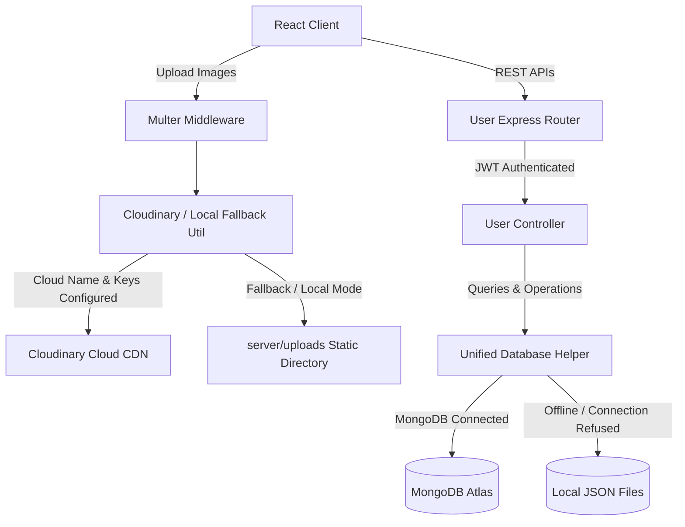

# User Profile System Implementation Report

A scalable, production-ready, and mobile-first user profile system has been implemented for **Campus Media**. The system features a modern design (Instagram/LinkedIn-style), integration with Cloudinary for asset storage (with local disk storage fallback), profile fields for professional projects/education, and tracks the histories of all AI modules (Resume Score, Mock Interviews, and generated Career Roadmaps).

---

## 🛠️ 1. Technical Architecture & Component Layout

The layout uses a modular, secure, and fail-safe design:



---

## 💾 2. Mongoose User Schema Updates
The schemas in `server/models/User.js` and `server/src/models/User.js` have been updated to support the following advanced attributes:

- **Basic Info**: `fullname`, `username`, `email`, `password`, `role`, `isVerified`, `status`, `year`.
- **Profile Customizations**: `bio`, `headline`, `location`, `website`, `profilePicture`, `coverPicture`.
- **Professional Details**: `skills` (array of strings), `education` (array of school objects), `projects` (array of project links/details), and `achievements` (array of accomplishments).
- **Social Metatags**: `followersCount`, `followingCount`, `postsCount`.
- **AI Modules History**:
  - `resumeHistory`: Tracks analysis scores, feedback, and timestamp.
  - `aiInterviewHistory`: Logs interview mock roles, attempt dates, feedback, and performance percentage.
  - `roadmapHistory`: Stores generated career roadmaps metadata.
- **Online/Offline Status**: `onlineStatus` ('online', 'offline') and `lastSeen` timestamp.

---

## ☁️ 3. Cloudinary & Multer Utility (`server/utils/cloudinary.js`)
To ensure the system works seamlessly out of the box regardless of whether external cloud credentials are provided:
- **Cloudinary mode**: Uploads are resized and compressed, sent directly to Cloudinary, and local temp files are instantly deleted.
- **Local Fallback mode**: Files are saved securely in `server/uploads/` with a unique identifier timestamp to prevent conflicts.
- **Cleanup**: Whenever a profile or cover photo is updated, the utility deletes the previous photo from Cloudinary or the local folder to avoid storage leaks.

> [!NOTE]
> Static asset serving is configured at `server.js` so that local files saved at `/uploads/...` are immediately renderable on the client.

---

## 🌐 4. REST APIs Implemented
All profile endpoints are registered under `/api/users/`:

| Method | Endpoint | Description | Headers |
| :--- | :--- | :--- | :--- |
| **GET** | `/profile` | Retrieves current logged-in user profile | `Authorization: Bearer <JWT>` |
| **GET** | `/:username` | Public view of any user by username (respects private visibility) | `Authorization: Bearer <JWT>` |
| **PUT** | `/profile` | Updates basic details (name, bio, location, website) | `Authorization: Bearer <JWT>` |
| **PUT** | `/profile-picture` | Uploads profile avatar (Form-Data field: `profilePicture`) | `Authorization: Bearer <JWT>` |
| **PUT** | `/cover-picture` | Uploads cover banner (Form-Data field: `coverPicture`) | `Authorization: Bearer <JWT>` |
| **PUT** | `/skills` | Replaces/saves the list of skills | `Authorization: Bearer <JWT>` |
| **PUT** | `/education` | Replaces/saves education qualifications | `Authorization: Bearer <JWT>` |
| **PUT** | `/projects` | Replaces/saves portfolio items | `Authorization: Bearer <JWT>` |
| **PUT** | `/achievements` | Replaces/saves personal milestones | `Authorization: Bearer <JWT>` |
| **PUT** | `/status` | Updates online status to `online` or `offline` | `Authorization: Bearer <JWT>` |

---

## 🎨 5. Mobile-First Profile UI (`client/src/pages/Profile.jsx`)
The frontend client has a gorgeous, premium UI incorporating:
- **Aesthetic Banner & Avatar Overlays**: Real-time image previews and upload controls if you are the profile owner.
- **Social Indicators**: Counts for Followers, Following, and Posts. Online indicators flash with a pulsate animation.
- **Interactive Tabs**:
  - **Overview**: Social activity summaries and joined indicators.
  - **AI Features & Scores**: Logs for mock interviews and resume reviews with color-accented percentage scores.
  - **Projects & Education**: Expandable forms to add/remove schools, bootcamps, and repository links.
  - **Skills & Badges**: Removable competency chips and custom achievements.
- **Permissions**: Owners can edit details directly; public users can only read (and are restricted if the profile visibility setting is `private`).

---

## 🚀 6. Production Deployment Recommendations
1. **Cloudinary Configuration**:
   Add the following environment variables to your `.env` file to activate cloud image storage:
   ```env
   CLOUDINARY_CLOUD_NAME=your_cloud_name
   CLOUDINARY_API_KEY=your_api_key
   CLOUDINARY_API_SECRET=your_api_secret
   ```
2. **File Size Limits**:
   Currently, file uploads are capped at **5MB** to prevent payload attacks. For production setups, this can be customized in `server/utils/cloudinary.js`.
3. **Database Indexes**:
   Create indexes on `username` and `email` for rapid user queries:
   ```js
   userSchema.index({ username: 1 }, { unique: true, sparse: true });
   ```
