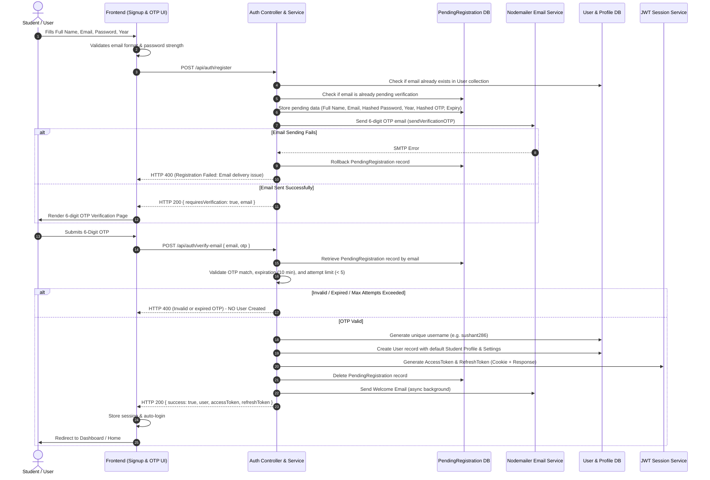

# Backend Server & Authentication Architecture (`server/`)

This directory contains the Node.js / Express.js REST API server that acts as the secure authentication provider, data management hub, and AI prompt execution engine for Campus Media.

---

## Redesigned Registration & Email Verification Architecture

Campus Media employs a **Verify-Before-Create** registration workflow. User accounts (`User` collection) are **never created** prior to successful email verification via a 6-digit OTP code.

### Registration Sequence Diagram



---

## PendingRegistration Schema

Pending registrations are stored temporarily in the `PendingRegistration` collection (or `data/pendingregistrations.json` fallback):

| Field | Type | Description |
|---|---|---|
| `fullname` | `String` | Student's full name (required, trimmed) |
| `email` | `String` | Unique lowercase email address (required) |
| `password` | `String` | Bcrypt hashed password (required) |
| `year` | `String` | Academic class year (e.g. `1st Year`) |
| `otp` | `String` | Bcrypt hashed 6-digit verification code |
| `attempts` | `Number` | Incorrect verification attempts counter (default `0`, max `5`) |
| `expiresAt` | `Date` | Time-to-live expiration timestamp (10 minutes) |
| `createdAt` | `Date` | Registration initiation timestamp |

*Note: MongoDB TTL index `expireAfterSeconds: 0` automatically purges expired pending records.*

---

## OTP Lifecycle & Security Measures

1. **Expiration & Single-Use**:
   - OTP codes expire strictly after 10 minutes.
   - Upon successful verification, the `PendingRegistration` record is immediately purged, making OTPs strictly single-use.
2. **Attempt Limits & Lockout**:
   - A maximum of 5 incorrect verification attempts are permitted per pending registration.
   - Exceeding 5 attempts immediately purges the pending record, requiring the user to re-initiate registration.
3. **Password Security**:
   - Passwords are strictly hashed with bcrypt (10 rounds) before storage in `PendingRegistration` and subsequent transfer to `User`.
4. **Duplicate Protection**:
   - Attempts to register with an email already present in `User` return `"Email is already registered"`.
   - Attempts to re-register while a pending registration is active return `"Email verification pending"`.
5. **Transaction Safety**:
   - Account creation, profile setup, and session creation happen atomically. If session generation fails, the created `User` record is rolled back.

---

## Authentication API Endpoints

### 1. Register Account Initiation
- **Endpoint**: `POST /api/auth/register`
- **Payload**:
  ```json
  {
    "fullname": "Sushant Awalekar",
    "email": "sushant@campusmedia.edu",
    "password": "StrongPassword@123",
    "year": "1st Year"
  }
  ```
- **Response** (HTTP 200):
  ```json
  {
    "requiresVerification": true,
    "email": "sushant@campusmedia.edu",
    "message": "Registration initiated! A 6-digit confirmation code was sent to your email."
  }
  ```

### 2. Verify Email OTP & Create User
- **Endpoint**: `POST /api/auth/verify-email`
- **Payload**:
  ```json
  {
    "email": "sushant@campusmedia.edu",
    "otp": "123456"
  }
  ```
- **Response** (HTTP 200):
  ```json
  {
    "success": true,
    "user": {
      "id": "65b...",
      "fullname": "Sushant Awalekar",
      "username": "sushant286",
      "email": "sushant@campusmedia.edu",
      "role": "USER",
      "isVerified": true
    },
    "accessToken": "eyJhbG...",
    "refreshToken": "eyJhbG...",
    "message": "Account created and email verified successfully!"
  }
  ```

### 3. Resend OTP
- **Endpoint**: `POST /api/auth/resend-otp`
- **Payload**:
  ```json
  {
    "email": "sushant@campusmedia.edu",
    "type": "EMAIL_VERIFICATION"
  }
  ```
- **Response** (HTTP 200):
  ```json
  {
    "success": true,
    "message": "A new verification code has been dispatched to your email."
  }
  ```

### 4. Login
- **Endpoint**: `POST /api/auth/login`
- **Payload**:
  ```json
  {
    "email": "sushant@campusmedia.edu",
    "password": "StrongPassword@123"
  }
  ```

---

## System Architecture Summary

* **`server.js`**: Express server entry point, rate limiting, and middleware definitions.
* **`controllers/authController.js`**: API HTTP request handler for authentication routes.
* **`services/authService.js`**: Core business logic for pending registration, OTP verification, unique username generation, and JWT session creation.
* **`services/dbHelper.js`**: Dual-mode database wrapper for MongoDB and fallback local filesystem JSON databases.
* **`services/emailService.js`**: Nodemailer integration with HTML templates for OTP dispatch, welcome emails, and password resets.
